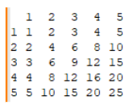

# Задачи на сообразительность

## Задача №1
У вас есть восемь монет и одни весы с двумя чашами. Одна монета немного тяжелее остальных. Как за два взвешивания найти тяжелую монету?

### Ответ
У нас есть 8 монет ( 1, 2, 3, 4, 5, 6, 7, 8 ).

Разделим на две кучки ( 1, 2, 3 ) и ( 4, 5, 6 ).
  1) Если кучка ( 1, 2, 3 ) = ( 4, 5, 6 ).
     Это означает что нужная монетка находится в кучке ( 7, 8 ).

     1.1 Взвешиваем ( 7 ) и ( 8 ). В таком случаи мы получим результат ( 7 ) > или < ( 8 ). Это означает что монетка оказавшаяся тяжелее и есть нужная.

  2) Если кучка ( 1, 2, 3 ) > или < ( 4, 5, 6 ).
     Берём ту кучку которая оказалась тяжелее, например ( 1, 2, 3 ) и взвешиваем ( 1 ) и ( 2 ).

     2.1 Если ( 1 ) = ( 2 ).
         Это означает что ( 3 ) и есть нужная монетка.

     2.2 Если ( 1 ) > или < ( 2 ).
         Это означает что монетка оказавшаяся тяжелее и есть нужная.

<p align="center">
    
</p>


## Задача №2
Есть числа от трех до одиннадцати. Есть квадрат — 3 на 3 клетки:
$$
\begin{pmatrix}
а & б & в \\
г & д & е \\
ё & ж & з \\
\end{pmatrix}
$$

(Буквы ничего не значат, кроме того, что числа не повторяются)
Можно ли расставить числа в клетки квадрата таким образом, что перемножения чисел в строках дает тот же результат, что и произведение чисел в столбцах с теми же номерами?
Если можно — расставьте, если нельзя — объясните почему.

### Ответ
Решим с помощью скрипта `magic-square.js`

#### Команда для запуска
``` sh
npm run magic-square
```

$$
\begin{pmatrix}
7 & 3 & 8 \\
6 & 9 & 5 \\
4 & 10 & 11 \\
\end{pmatrix}
$$


#### Проверка произведений по строкам
1) Первая строка: $\large 7 × 3 × 8 = 168$
2) Первая строка: $\large 6 × 9 × 5 = 270$
3) Первая строка: $\large 4 × 10 × 11 = 440$

Произведения по строкам: 168, 270, 440

#### Проверка произведений по столбцам
1) Первый столбец: $\large 7 × 6 × 4 = 168$
2) Первый столбец: $\large 3 × 9 × 10 = 270$
3) Первый столбец: $\large 8 × 5 × 11 = 440$

Произведения по столбцам: 168, 270, 440

#### Результат
1) Первая строка равна первому столбцу (168 = 168)
2) Вторая строка равна второму столбцу (270 = 270)
3) Третья строка равна третьему столбцу (440 = 440)

## Задача №3
Ученые разработали новый материал неизвестной прочности. Они знают, что материал разбивается при падении с высоты от 1 метра до 5 000 метров. Но не знают, с какой именно высоты. Чтобы определить прочность, ученые поднимают предмет на некоторую высоту и сбрасывают его оттуда. Их задача — определить, начиная с какой именно высоты предмет начнет разбиваться. 

Специальная платформа, с помощью которой они осуществляют эксперимент, скидывает предмет только с дискретных высот (1, 2, 3 ... 4999, 5000 метров — платформа не может скинуть предмет, например, с 2,5 метров. Точности в 1 метр ученым вполне достаточно). При падении с высоты "n" метров предмет уничтожается. Если же его сбрасывали с высоты ниже "n", то его можно использовать в повторных экспериментах.

Нужно АБСОЛЮТНО ТОЧНО найти ту высоту, начиная с которой предметы разрушаются. Сделать это нужно за МИНИМАЛЬНО возможное число экспериментов. У ученых при этом всего 2 предмета, но они абсолютно одинаковые. Каким образом этого можно достигнуть? Сколько экспериментов при этом максимально потребуется?

### Ответ

1) Максимально возможное количество попыток будет 5000 и предмет     разобьется с высоты 5000м

2) Минимально возможное количество попыток будет 2. Это случится, если учёные угадают нужную высоту. Например, первой попыткой они бросают предмет с высоты 2000м, и предмет разбивается. Тогда они берут второй предмет и бросают его с высоты 1999м, и он остаётся целым. Таким образом учёные нашли максимальную высоту, с которой может разбиться предмет за минимальное количество попыток.

3) Если исключить вариант с тем, что учёным повезет, то можно использовать шаг произвольной длины. Например, 100. Начинаем испытание 100м, 200м, 300м, 400м и на 500м предмет разбивается, так мы получаем диапазон от 400м до 500м. По нему проходимся с шагом в 1м пока не найдём высоту, с которой он не разобьётся.

## Задача №4
В университетскую столовую пришли трое студентов купить пирожки. Один хочет купить треть всех имеющихся в столовой пирожков и еще 2 пирожка. Другой хочет купить четверть от всех имеющихся пирожков и ещё 3 пирожка. А третий хочет купить пятую часть всех пирожков и ещё 8 пирожков. Если все трое купят столько пирожков, сколько планируют, то в столовой как раз закончатся все пирожки. Сколько пирожков есть в столовой? 

### Ответ
Представим данную ситуацию как уравнение в виде:

$\large (x\frac{1}{3} + 2) + (x\frac{1}{4} + 3) + (x\frac{1}{5} + 8) = x$

#### Шаги решения:

1) Приведение к общему знаменателю
   
   $\large (x\frac{20}{60} + 2) + (x\frac{15}{60} + 3) + (x\frac{12}{60} + 8) = x$

2) Складываем 
   
   $\large x\frac{47}{60} + 13 = x$

3) Переносим за знак равенства 13

   $\large x\frac{47}{60} = x - 13$

4) Переносим за знак равенства x

   $\large -x\frac{13}{60} = - 13$

5) Умножаем всё на -60

   $\large 13x = 780$

6) Делим всё на 13

   $\large x = 60$

#### Результат:
60 пирожков

# Задачи по программированию

### Стек технологий
- JavaScript - использовался для решения задач
- Jest - использовался для тестирования

## Запуск тестов
``` sh
npm test
```

## Задача №1
Разработайте функцию, которая принимает целое число в качестве аргумента и возвращает строку, содержащую это число и слово "компьютер" в нужном склонении по падежам в зависимости от числа. Например, при вводе числа 25 функция должна возвращать "25 компьютеров", для числа 41 — "41 компьютер", а для числа 1048 — "1048 компьютеров".

#### Команда для запуска
``` sh
npm run task-1
```

## Задача №2
Написать функцию/метод, которая на вход получает массив положительных целых чисел произвольной длины. Например [42, 12, 18]. На выходе возвращает массив чисел, которые являются общими делителями для всех указанных числе. В примере это будет [2, 3, 6].

#### Команда для запуска
``` sh
npm run task-2
```

## Задача №3
Написать функцию/метод, которая возвращает массив простых чисел в диапазоне (2 числа - минимальное и максимальное) заданных чисел. Например, на вход переданы 2 числа: от 11 до 20  (диапазон считается включая граничные значения).

#### Команда для запуска
``` sh
npm run task-3
```

## Задача №4
Написать метод, который в консоль выводит таблицу умножения. На вход метод получает число, до которого выводит таблицу умножения. В консоли должна появиться таблица. Например, если на вход пришло число 5, то получим:

<p align="center">
    
</p>

#### Команда для запуска
``` sh
npm run task-4
```
